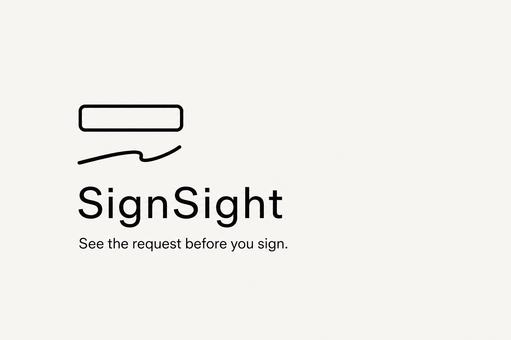
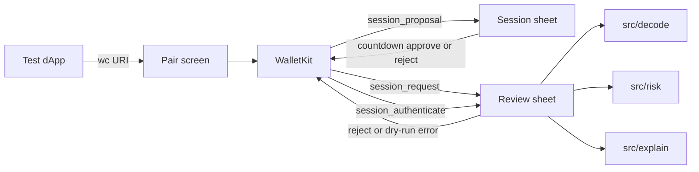

# SignSight



Portfolio demo wallet. See the request before you sign.

React Native CLI (TypeScript). A dApp pairs over WalletConnect. This wallet shows a human summary of `eth_sendTransaction`, `personal_sign`, and `session_authenticate` (SIWE). It is not a custodial product. No mainnet funds. No seed phrase flow.

## Architecture



## Run

```
npm install
npx react-native run-ios
# or
npx react-native run-android
```

Copy `.env.example` to `.env`:

```
WALLETCONNECT_PROJECT_ID=
EXPLAIN_PROVIDER=mock
EXPLAIN_API_URL=
EXPLAIN_API_KEY=
```

Do not commit `.env`. Do not invent a project id.

Package: `com.signsight.app`. Scheme: `signsight://`.

## Demo

See [docs/demo.md](docs/demo.md). Pair, watch the session countdown, review an infinite USDT approve (symbol visible), Explain (mock), keep risk rows visible, Reject, check History.

## Threats

See [docs/threat-model.md](docs/threat-model.md). Dry-run never broadcasts and never returns a fake hash or SIWE signature. The explainer is copy only.

## Tests

```
npm test
```

Covers six risk codes, USDT/WETH labels, SIWE happy and malformed paths, and the explainer post-filter.
