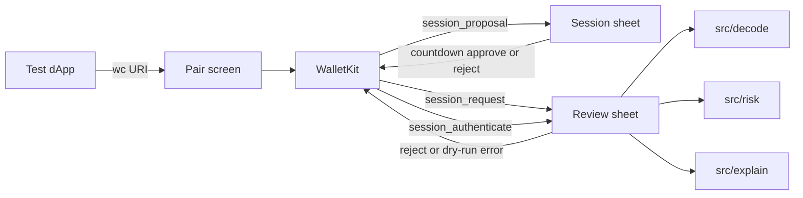

# SignSight


See the request before you sign.

This is a React Native CLI wallet I built as a portfolio demo. A test dApp pairs over WalletConnect. The app shows you what `eth_sendTransaction`, `personal_sign`, `eth_signTypedData_v4`, and SIWE (`session_authenticate`) actually say, then you reject or dry-run.

It is not a custodial product. There is no seed phrase screen and no mainnet. Dry-run is on by default. The dApp gets an error back, not a fake hash or signature.

## How it fits together



Decode and risk run on device. The explainer is optional copy. It never decides the buttons.

More in [docs/architecture.md](docs/architecture.md). Screens and the request path are under [docs/arch/](docs/arch/screens.md). Shapes we persist are in [docs/schema/](docs/schema/README.md).

## Run

```
npm install
npx react-native run-ios
# or
npx react-native run-android
```

Copy `.env.example` to `.env` and put in a WalletConnect project id. Leave the explainer on mock unless you have a local HTTP endpoint.

```
WALLETCONNECT_PROJECT_ID=
EXPLAIN_PROVIDER=mock
EXPLAIN_API_URL=
EXPLAIN_API_KEY=
DEMO_SIGNER_KEY=
DEMO_SIGNER_RPC=http://127.0.0.1:8545
```

Don't commit `.env`. Don't invent a project id.

Package is `com.signsight.app`. Scheme is `signsight://`.

## Demo

[docs/demo.md](docs/demo.md) is the path I'd walk a reviewer through. Pair, session countdown, infinite USDT approve, Explain without hiding the risk rows, Reject, then a Permit.

## Threats

[docs/threat-model.md](docs/threat-model.md). Short version: local rules do the judging. Dry-run never pretends a tx landed. A language-model sentence cannot clear a high-severity row.

## Tests

```
npm test
```

Risk codes, USDT/WETH labels, SIWE, typed-data fixtures, demo-signer signatures, and the explainer post-filter.
