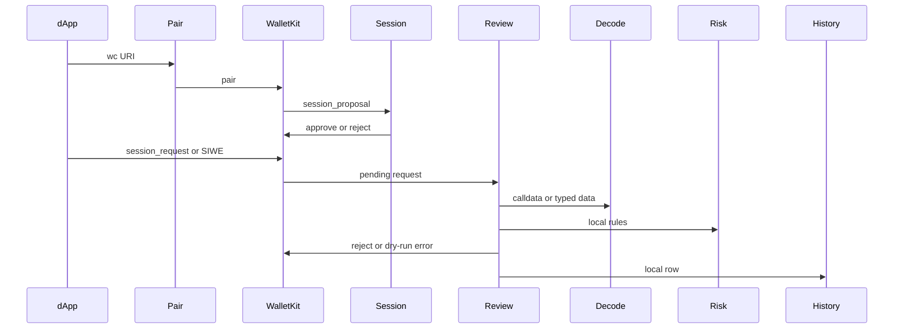

# Request flow

This is the path a request actually takes. No extra services in the middle.

Pairing is WalletKit. We approve Sepolia and the four methods in `src/wallet/chain.ts`. That's it.

A session request lands in `appState.pendingRequest`. SIWE lands in `pendingAuth`. Review reads that, decodes, runs risk, then you pick.

Dry-run calls `respondSessionRequest` with an error object. There is no `result`. I don't invent a hash or a signature so the dApp can pretend it worked.

If you turn on Demo signer, `completeDemoSign` can return a real local signature or an Anvil hash. That path uses `DEMO_SIGNER_KEY` and `DEMO_SIGNER_RPC`. It does not broadcast to Sepolia.

Malformed SIWE (no domain or nonce) gets rejected on the way in. We don't ask you to tidy it up.
