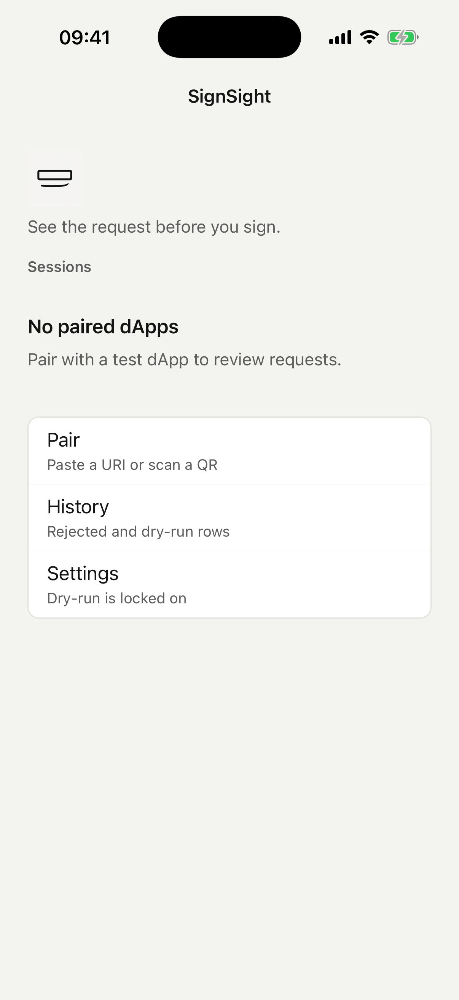
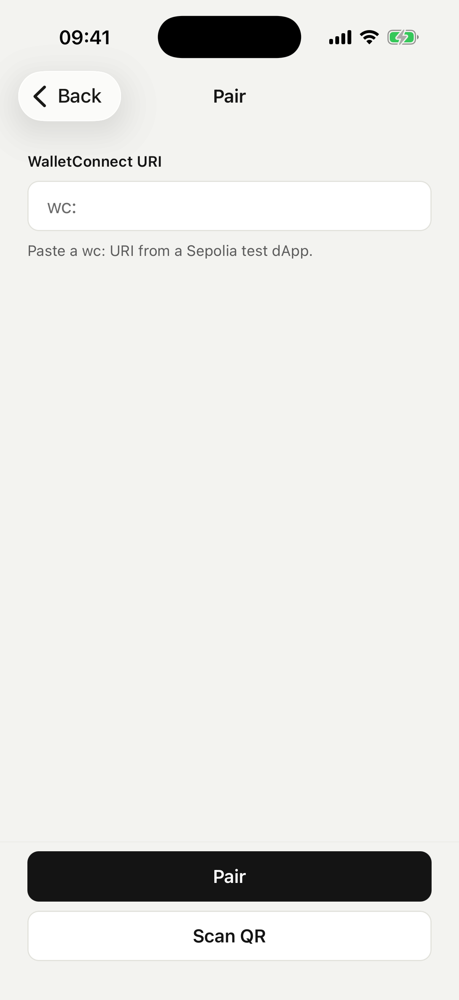
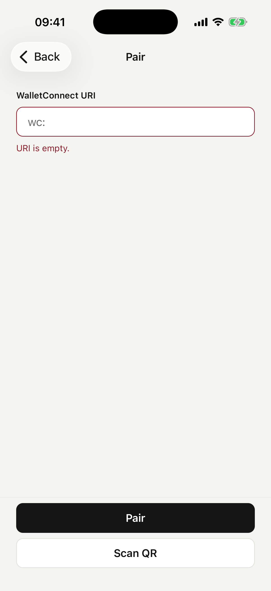
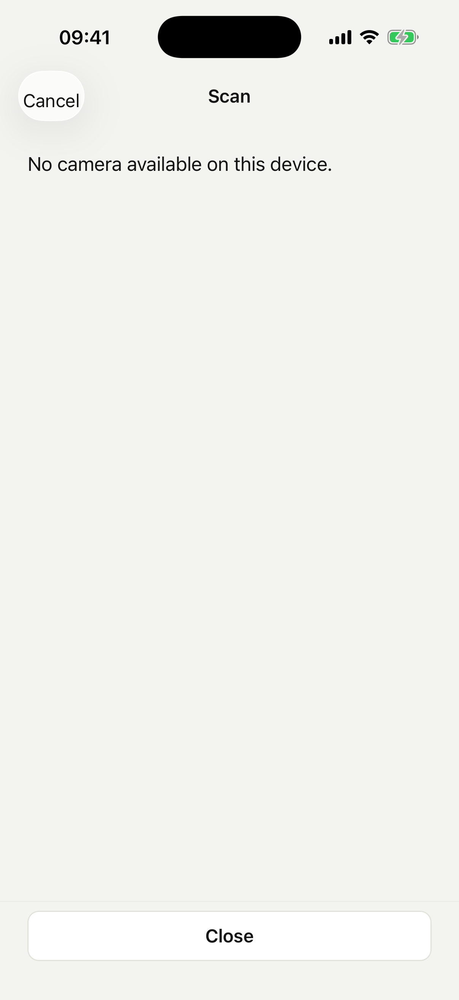
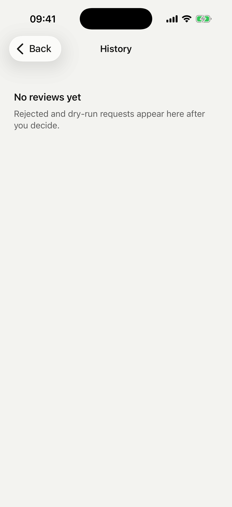
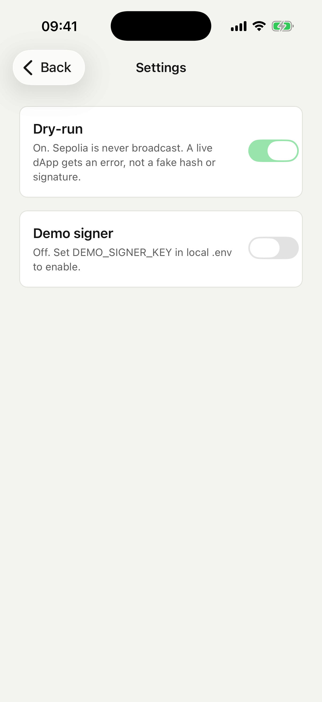

# Screens

Home is the root. Pair, History, and Settings push. Session and Review come up as sheets. Scan is a full-screen camera with Cancel.

I did it that way because a pairing request or a signing request is a decision, not another page in a stack. If something is waiting, Home opens the sheet. You can swipe it down. The banner is still there.

| Screen | How you get there | What it's for |
| --- | --- | --- |
| Home | launch | Sessions, pending banner, Pair / History / Settings |
| Pair | push | Paste a `wc:` URI |
| Scan | full-screen over Pair | QR that starts with `wc:` |
| Session | sheet | dApp URL, `mm:ss` countdown, Approve / Reject / Disconnect |
| Review | sheet | Summary, risk rows, Explain, raw hex or JSON, Reject first |
| History | push | Local rows. Nothing leaves the phone. |
| Settings | push | Dry-run locked on. Demo signer only if `.env` has a key. |

Approve on Session dies at `00:00`. Reject and Disconnect still work. Disconnect asks first.

Review does not use the explainer sentence to enable or hide a button. Reject is first. Dry-run is the default second action. Demo sign only shows if you turned that switch on.

## Shots from a cold launch

These are from the iOS simulator after a fresh install. No dApp, so Session and Review are not here. Those only exist when WalletKit has something pending.

Home has the mark and the line, then an empty Sessions block, then Pair / History / Settings. The header already says SignSight, so the body does not repeat the name as a title.

Pair is a single field. Helper text says Sepolia. Empty URI turns the field red and says `URI is empty.`

Scan is a full-screen modal. On the simulator there is no camera, so you get that sentence and Close. Cancel is in the header.

History is empty until you reject or dry-run something.

Settings: dry-run switch is on and disabled. Demo signer stays off unless `DEMO_SIGNER_KEY` is in local `.env`.

