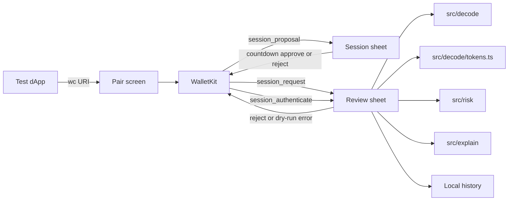

# Architecture

- Wallet side: `@reown/walletkit` + `@walletconnect/react-native-compat` (compat import is first in `index.js`).
- One chain: Sepolia. Methods: `eth_sendTransaction`, `personal_sign`, `session_authenticate`.
- Decode is viem `decodeFunctionData` on transfer/approve.
- Risk rules are local functions. The explainer is optional copy.
