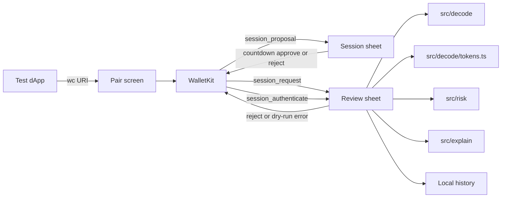

# Architecture

SignSight is a wallet-side WalletConnect client. The dApp already exists. We pair, then we review what it asks us to sign.

I used `@reown/walletkit` with `@walletconnect/react-native-compat`. That compat import has to be first in `index.js` or the polyfills fight you.

One chain: Sepolia (`eip155:11155111`). Methods we advertise: `eth_sendTransaction`, `personal_sign`, `eth_signTypedData_v4`, `session_authenticate`.

Calldata goes through viem `decodeFunctionData` for transfer, approve, increaseAllowance, and decreaseAllowance. Typed data is a separate parse. If we don't know it, we say so. We don't guess.

Token labels are a static map in `src/decode/tokens.ts`. USDT on that Sepolia address is a demo label. It is not official Tether.

Risk is a local function. No model in that path. The explainer, if you turn it on, writes a sentence. Review still shows the risk rows, and Reject / Dry-run ignore the sentence.

Demo signer is optional. A key in `.env` can return a real local signature or an Anvil hash. That's for a dApp that refuses to continue on an error. It does not talk to Sepolia.

Screens are in [docs/arch/screens.md](arch/screens.md). The request path is in [docs/arch/request-flow.md](arch/request-flow.md). JSON schema is [docs/schema/](schema/README.md).
